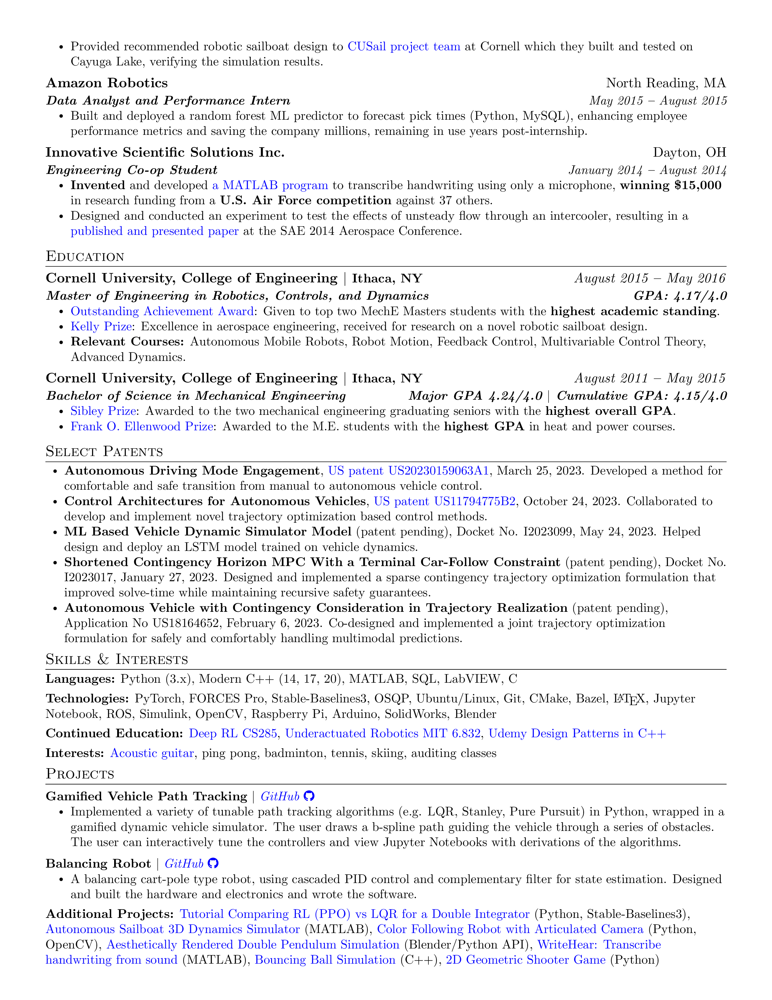

# Jesse Miller Resume

My resume written in LaTeX. Note that different variations of the resume may be maintained on separate branches.

## View PDF

* [View resume in a browser](https://mozilla.github.io/pdf.js/web/viewer.html?file=https://raw.githubusercontent.com/jam643/resume/main/jesse_miller_resume.pdf)
* [Click here to download](https://raw.githubusercontent.com/jam643/resume/main/jesse_miller_resume.pdf)

## Screenshots

Note that the hyperlinks won't work viewing as screenshots

<p align="center">
    
    
    
</p>


## Compiling

### In Cloud

Copy .tex file to [Overleaf](https://www.overleaf.com/) and save as pdf.

### Locally on Mac

* Download and install MacTex (or Basic Tex and install additional LaTeX packages with tlmgr)
* Install LaTeX Workshop plugin for VSCode and compile through IDE
* Alternatively, compile in the terminal via:
```bash
pdflatex jesse_miller_resume.tex
```
* Run the following in a terminal to generate png screenshots from the pdf:
```bash
magick -density 300 jesse_miller_resume.pdf -background white -alpha remove -quality 90 images/jesse_miller_resume.png
```


